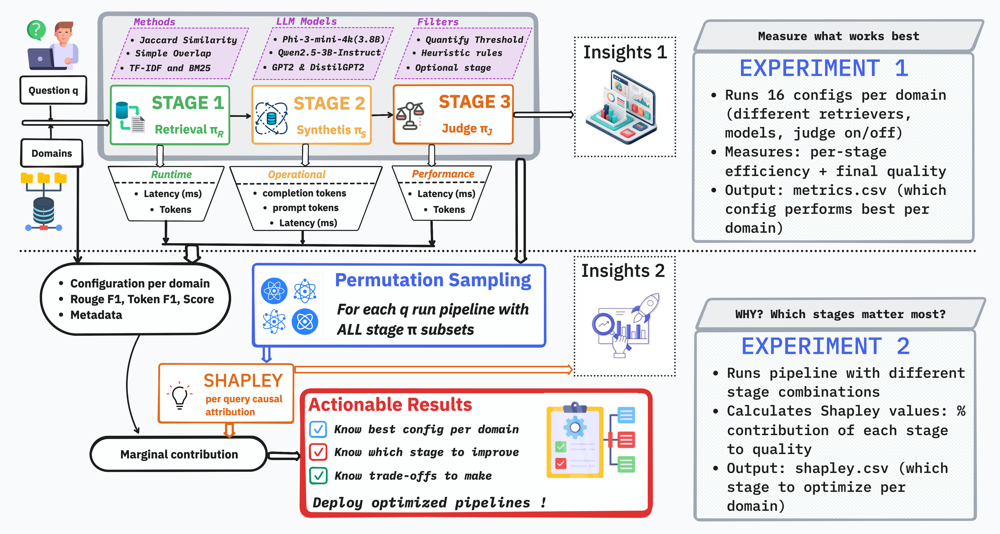

# XPipe: Explainable Multi-Stage Large Language Models Pipeline Evaluation via Causal Attribution

[](https://opensource.org/licenses/MIT)
[](https://www.python.org/downloads/)
[](https://kaleidoscope2026.itu.int)

## 📖 Overview


**XPipe** is the first framework to apply **Shapley value causal attribution** to multi-stage Large Language Model (LLM) pipeline evaluation for telecommunications systems. When RAG pipelines fail in safety-critical infrastructure, XPipe answers the critical question: ***Which component is responsible?***

### The Problem

Multi-stage LLM pipelines (retrieval → synthesis → quality control) are increasingly deployed in telecommunications for:
- 🔧 Network troubleshooting and diagnostics
- 📞 Customer support automation
- 📋 ITU standards compliance checking
- ⚖️ Legal document analysis
- ⚡ Energy/electricity data analysis

**But when pipelines fail, operators cannot identify which component failed:**
- Was it poor document retrieval?
- Weak language model reasoning?
- Inadequate quality control?

### The Solution

XPipe treats pipeline stages as **players in a cooperative game**, using **Shapley values** from game theory to quantify each stage's fair contribution to overall quality. By running pipelines with different stage combinations and computing marginal contributions, XPipe provides:

✔ **Quantitative Attribution**: Not just "does this help?" but "*how much* does each stage contribute?"
✔ **Domain-Specific Insights**: Optimal configurations vary dramatically by domain
✔ **Actionable Optimization**: Evidence-based resource allocation decisions

---

## 🎯 Key Findings

### Stage Contributions Vary Dramatically by Domain

| Domain | Retrieval Φ | Synthesis Φ | Judge Φ | Optimization Strategy |
|--------|-------------|-------------|---------|----------------------|
| **Legal (TBMP)** | **41.5%** | 35.4% | 23.1% | **Improve retrieval** (keyword matching critical) |
| **Network Logs** | 29.8% | **45.5%** | 24.7% | **Improve synthesis** (technical reasoning needed) |
| **Customer Support** | 29.4% | 32.7% | **37.9%** | **Balanced improvement** across all stages |
| **ITU Standards** | 34.2% | 38.1% | 27.7% | Moderate synthesis focus |
| **Energy Data** | 31.5% | 40.2% | 28.3% | Synthesis-driven |

**Insight**: No universal pipeline configuration exists. Resource allocation must be domain-adapted.

### Quality Control Trade-offs

| Domain | Quality Gain | Latency Increase | Recommendation |
|--------|--------------|------------------|----------------|
| Legal | +98% | +340ms | **Enable** (critical accuracy) |
| Network | +64% | +180ms | **Enable** (moderate gain) |
| Customer Support | +0% | +250ms | **Disable** (no value) |

**Insight**: Quality control provides 0-98% improvement depending on domain, enabling informed latency-accuracy trade-offs.

---

## 🚀 Quick Start

### Installation

```bash
# Clone repository
git clone https://github.com/hosei-university-iist-yulab/XPipe.git
cd XPipe

# Install dependencies
pip install -r requirements.txt
```

### Run Experiments

```bash
# Experiment 1: Multi-Domain Evaluation (16 configs × 5 domains × 14 queries)
python experiments/exp1_multidomain.py

# Experiment 2: Shapley Attribution Analysis (20 permutations × 5 domains)
python experiments/exp2_attribution.py
```

---

## 📊 Methodology

### Shapley Value Attribution

Each pipeline stage is treated as a player in a cooperative game where the "payout" is ROUGE-L F1 quality score:

```
Φᵢ = 1/|M|! Σ |S|!(|M|-|S|-1)!/|M|! [v(S ∪ {i}) - v(S)]
```

Where:
- `Φᵢ` = Shapley value (contribution) of stage `i`
- `v(S)` = Pipeline quality with stage subset `S`
- `M` = {Retrieval, Synthesis, Judge}

**Properties**:
- ✔ **Efficiency**: Contributions sum to total quality
- ✔ **Symmetry**: Equal contributors receive equal credit
- ✔ **Null player**: Non-contributors get zero credit

### Permutation Sampling Algorithm

Instead of computing 2^|M| evaluations (exponential), XPipe uses permutation sampling with N=20 for 8× speedup with <7% variance:

```
1. Sample 20 random stage orderings (permutations)
2. For each ordering, compute marginal contributions
3. Average across all permutations
4. Normalize to sum to 1.0
```

---

## 🏗️ Architecture

```
┌─────────────────────────────────────────────────────────────┐
│                    XPipe Framework                          │
├─────────────────────────────────────────────────────────────┤
│                                                             │
│  ┌──────────┐    ┌──────────┐    ┌──────────┐             │
│  │Retrieval │───>│Synthesis │───>│  Judge   │             │
│  │  Stage   │    │  Stage   │    │  Stage   │             │
│  │ (Top-3)  │    │  (LLM)   │    │(Optional)│             │
│  └──────────┘    └──────────┘    └──────────┘             │
│       │               │                │                    │
│       └───────────────┴────────────────┘                    │
│                       │                                     │
│              ┌────────▼─────────┐                          │
│              │ Shapley Analyzer │                          │
│              │ (20 permutations)│                          │
│              └────────┬─────────┘                          │
│                       │                                     │
│       ┌───────────────┼───────────────┐                    │
│       │               │               │                    │
│  ┌────▼────┐    ┌────▼────┐    ┌────▼────┐               │
│  │Retrieval│    │Synthesis│    │  Judge  │               │
│  │Shapley  │    │ Shapley │    │ Shapley │               │
│  │  (Φᵣ)   │    │  (Φₛ)   │    │  (Φⱼ)   │               │
│  └─────────┘    └─────────┘    └─────────┘               │
│                                                             │
└─────────────────────────────────────────────────────────────┘
```

---

## 📚 Datasets

XPipe is evaluated on **5 real-world telecommunications domains**:

| Domain | Corpus Size | Queries | Source | Complexity |
|--------|-------------|---------|--------|------------|
| **Network Logs** | 154 cases | 14 | Stack Exchange Network Engineering | Technical diagnostics |
| **Customer Support** | 200 conversations | 14 | Twitter (Verizon, AT&T, Sprint) | Issue resolution |
| **ITU Standards** | 13 recommendations | 14 | ITU-T Official Docs | Compliance checking |
| **Legal (TBMP)** | 2 sections | 14 | USPTO TTAB Manual | Legal procedures |
| **Energy Data** | Time-series data | 14 | Pecan Street | Analytical queries |

**Total**: 369 documents, 70 queries with expert-annotated reference answers

---

## 🔬 Experiments

### Experiment 1: Multi-Domain Evaluation

**Goal**: Compare 16 pipeline configurations across 5 domains

**Variables**:
- Retrieval: Simple Overlap vs Jaccard Similarity
- Synthesis: GPT-2 (124M), DistilGPT2 (82M), Qwen2.5-3B, Phi-3-mini (3.8B)
- Judge: Enabled vs Disabled

**Total Evaluations**: 16 configs × 5 domains × 14 queries = **1,120 pipeline runs**

**Key Result**: Best configurations differ dramatically:
- Legal: Simple Overlap + Qwen2.5-3B + Judge Enabled (0.160 ROUGE-L F1)
- Network: Jaccard + Phi-3-mini + Judge Enabled (0.148 ROUGE-L F1)
- Customer Support: No configuration differentiation (all 0.015 F1)

### Experiment 2: Shapley Attribution Analysis

**Goal**: Quantify each stage's causal contribution

**Method**: 20 permutation samples per domain, averaged across 14 queries

**Total Evaluations**: 20 permutations × 3 stages × 5 domains × 14 queries = **4,200 ablation runs**

**Key Result**: Stage importance rankings differ by domain, enabling targeted optimization

---

## 🛠️ Technical Stack

- **Language**: Python 3.8+
- **LLM Backends**: HuggingFace Transformers (GPT-2, DistilGPT2, Qwen2.5, Phi-3)
- **Retrieval**: Lexical matching (Simple Overlap, Jaccard)
- **Evaluation**: ROUGE-L, Token F1, Grounding Score
- **Attribution**: Shapley value permutation sampling
- **Visualization**: Matplotlib, Seaborn

---

## 📄 Citation

If you use XPipe in your research, please cite our ITU Kaleidoscope 2026 paper:

```bibtex
@INPROCEEDINGS{Messou2026XPipe,
  author={Messou, Franck Junior Aboya and Zhang, Shilong and Wang, Weiyu and Yu, Tao and Liu, Tong and Chen, Jinhua and Yu, Keping},
  booktitle={ITU Kaleidoscope 2026: The Evolution of Intelligent Communication Systems},
  title={XPipe: Explainable Multi-Stage LLM Pipeline Evaluation via Causal Attribution for Telecommunications},
  year={2026},
  month={July}
}
```

---

## 📚 Related Publications by Authors

#### 2025

<details>
<summary><b>[VTC2025-Spring]</b> Federated Fine-Tuning of Large Language Models for Intelligent Automotive Systems with Low-Rank Adaptation</summary>

```bibtex
@INPROCEEDINGS{Chen2025FedLLM,
  author={Chen, Jinhua and Messou, Franck Junior Aboya and Zhang, Shilong and Liu, Tong and Yu, Keping and Niyato, Dusit},
  booktitle={2025 IEEE 101st Vehicular Technology Conference (VTC2025-Spring)},
  title={Federated Fine-Tuning of Large Language Models for Intelligent Automotive Systems with Low-Rank Adaptation},
  year={2025},
  month={Jun},
  address={Oslo, Norway},
  doi={10.1109/VTC2025-Spring65109.2025.11174441}
}
```
</details>

<details>
<summary><b>[ICUFN 2025]</b> TSFormer: Temporal-Aware Transformer for Multi-Horizon Forecasting</summary>

```bibtex
@INPROCEEDINGS{Messou2025TSFormer,
  author={Messou, Franck Junior Aboya and Chen, Jinhua and Liu, Tong and Zhang, Shilong and Yu, Keping},
  booktitle={2025 Sixteenth International Conference on Ubiquitous and Future Networks (ICUFN)},
  title={TSFormer: Temporal-Aware Transformer for Multi-Horizon Forecasting with Learnable Positional Encodings and Attention Mechanisms},
  year={2025},
  month={Jul},
  address={Lisbon, Portugal},
  doi={10.1109/ICUFN65838.2025.11170021}
}
```
</details>

<details>
<summary><b>[CCNC 2025]</b> Enhancing Federated Learning with Decoupled Knowledge Distillation</summary>

```bibtex
@INPROCEEDINGS{Chen2025FedKD,
  author={Chen, Jinhua and Zhang, Shilong and Liu, Tong and Messou, Franck Junior Aboya and Yu, Keping},
  booktitle={2025 IEEE 22nd Consumer Communications \& Networking Conference (CCNC)},
  title={Enhancing Federated Learning in Consumer Electronics with Decoupled Knowledge Distillation against Data Poisoning},
  year={2025},
  month={Jan},
  doi={10.1109/CCNC54725.2025.10976151}
}
```
</details>

#### 2024

<details>
<summary><b>[VTC2024-Fall]</b> Byzantine-Fault-Tolerant Federated Learning for IoV</summary>

```bibtex
@INPROCEEDINGS{Chen2024Byzantine,
  author={Chen, Jinhua and Zhao, Zihan and Messou, Franck Junior Aboya and Katabarwa, Robert and Alfarraj, Osama and Yu, Keping and Guizani, Mohsen},
  booktitle={2024 IEEE 100th Vehicular Technology Conference (VTC2024-Fall)},
  title={A Byzantine-Fault-Tolerant Federated Learning Method Using Tree-Decentralized Network and Knowledge Distillation for Internet of Vehicles},
  year={2024},
  month={Oct},
  address={Washington, DC, USA},
  doi={10.1109/VTC2024-Fall63153.2024.10757805}
}
```
</details>

<details>
<summary><b>[VTC2024-Fall]</b> Short-Term Load Forecasting with CNN-BiLSTM</summary>

```bibtex
@INPROCEEDINGS{Messou2024LoadForecasting,
  author={Messou, Franck Junior Aboya and Chen, Jinhua and Katabarwa, Robert and Zhao, Zihan and Yu, Keping},
  booktitle={2024 IEEE 100th Vehicular Technology Conference (VTC2024-Fall)},
  title={Enhancing Short-Term Load Forecasting in Internet of Things: A Hybrid Attention-based CNN-BiLSTM with Data Augmentation Approach},
  year={2024},
  month={Oct},
  address={Washington, DC, USA},
  doi={10.1109/VTC2024-Fall63153.2024.10757868}
}
```
</details>

<details>
<summary><b>[VTC2024-Fall]</b> Resource-Efficient Malicious URL Detection</summary>

```bibtex
@INPROCEEDINGS{Zhao2024MaliciousURL,
  author={Zhao, Zihan and Chen, Jinhua and Messou, Franck Junior Aboya and Katabarwa, Robert and Yu, Keping},
  booktitle={2024 IEEE 100th Vehicular Technology Conference (VTC2024-Fall)},
  title={A Resource-efficient Text-to-Text Transfer Transformer Encoder-based Vertical Hybrid Model for Malicious URLs Detection},
  year={2024},
  month={Oct},
  address={Washington, DC, USA},
  doi={10.1109/VTC2024-Fall63153.2024.10757492}
}
```
</details>

---

## 👥 Authors & Affiliations

**Franck Junior Aboya Messou** (Lead Author)
Graduate School of Science and Engineering, Hosei University, Tokyo 184-8584, Japan
📧 franckjunioraboya.messou@ieee.org | franckjunioraboya.messou.3n@stu.hosei.ac.jp
[ResearchGate](https://www.researchgate.net/profile/Franck-Junior-Aboya-Messou) | [IEEE Xplore](https://ieeexplore.ieee.org/author/274956027119414) | [Google Scholar](https://scholar.google.ca/scholar?hl=fr&as_sdt=0%2C5&q=franck+junior+aboya+messou&btnG=)

**Jinhua Chen**
Graduate School of Science and Engineering, Hosei University, Tokyo 184-8584, Japan
📧 jinhua.chen@ieee.org

**Shilong Zhang**
Graduate School of Science and Engineering, Hosei University, Tokyo 184-8584, Japan
📧 shilong.zhang@ieee.org

**Tong Liu**
Graduate School of Science and Engineering, Hosei University, Tokyo 184-8584, Japan
📧 tong.liu@ieee.org

**Tao Yu**
Graduate School of Science and Engineering, Hosei University, Tokyo 184-8584, Japan
📧 tao.yu@ieee.org

**Weiyu Wang**
Graduate School of Science and Engineering, Hosei University, Tokyo 184-8584, Japan
📧 weiyu.wang@ieee.org

**Keping Yu**
Graduate School of Science and Engineering, Hosei University, Tokyo 184-8584, Japan
📧 keping.yu@ieee.org

---

## 📜 License

This project is licensed under the MIT License - see the [LICENSE](LICENSE) file for details.

---

## 🙏 Acknowledgments

This research is supervised by **Professor Keping Yu** (currently at Global Information and Telecommunication Institute, Waseda University, Tokyo, Japan).

This research is supported by:
- Graduate School of Science and Engineering, Hosei University, Tokyo, Japan
- Funded by the Ongoing Research Funding Program (ORF-2026-681), King Saud University, Riyadh, Saudi Arabia

---

## 📧 Contact

For questions or collaboration:
- **Email**: franckjunioraboya.messou.3n@stu.hosei.ac.jp
- **Issues**: [GitHub Issues](https://github.com/hosei-university-iist-yulab/XPipe/issues)

---

**⭐ If you find this work useful, please star the repository.**

